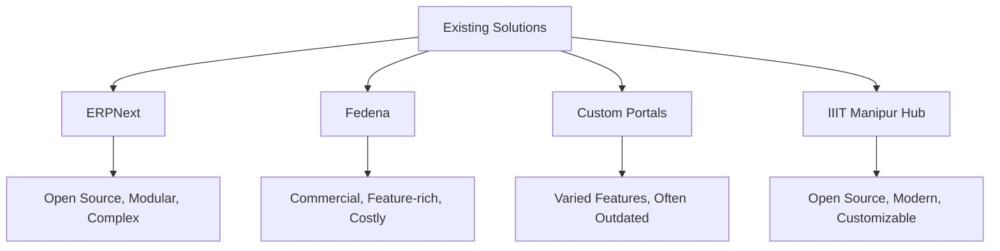
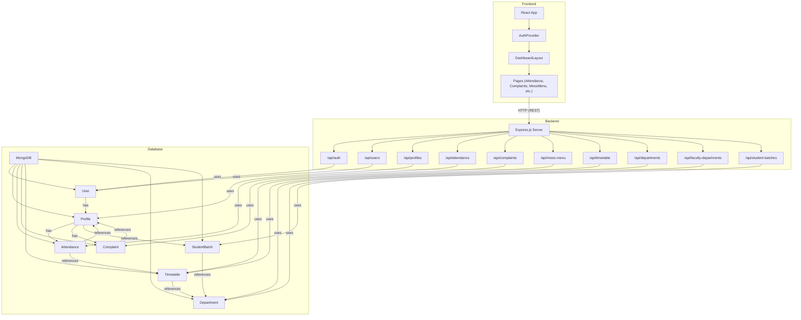
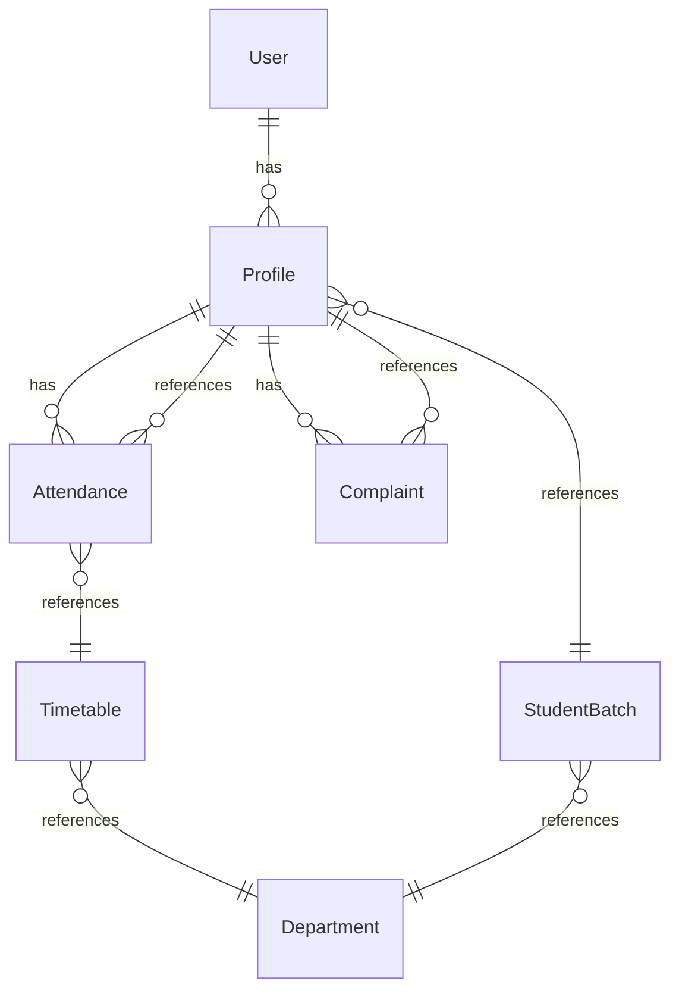
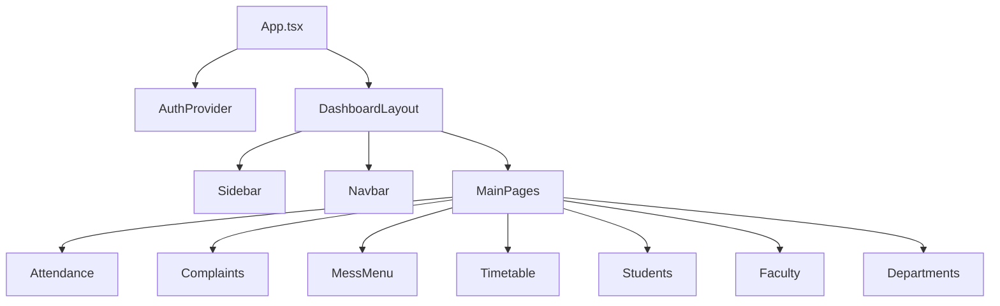
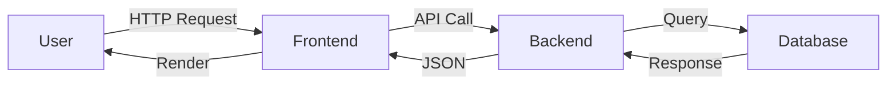
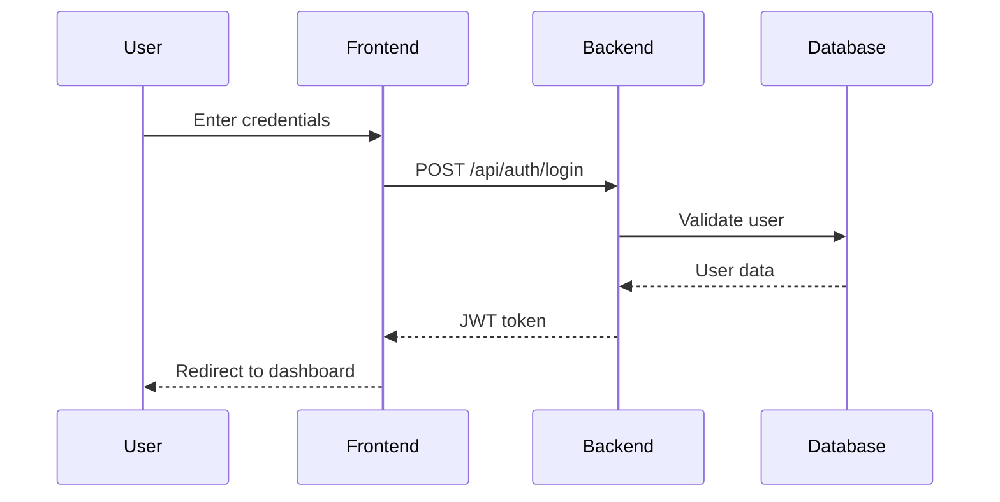

# IIIT Manipur Digital Campus Hub

---

## 1. Introduction

### 1.1 Background  
The digital transformation of educational institutions is essential for efficient management and enhanced student experience. IIIT Manipur Digital Campus Hub is designed to streamline academic, administrative, and student-related activities, providing a unified platform for all stakeholders.

### 1.2 Objectives  
- Centralize campus management (attendance, complaints, timetable, mess, etc.)
- Enable role-based access for students, faculty, admins, hostel wardens, and mess supervisors.
- Improve transparency, accountability, and communication.

### 1.3 Motivation  
Manual processes are time-consuming and error-prone. A digital solution increases efficiency, reduces paperwork, and provides real-time access to information.

### 1.4 Scope  
The system covers user management, attendance, complaints, timetable, mess menu, and department management, with extensibility for future modules.

---

## 2. Literature Survey

### 2.1 Existing Solutions  
- **ERPNext Education:** Open-source, modular, but complex to customize.
- **Fedena:** Commercial, feature-rich, but costly and closed-source.
- **Custom University Portals:** Often lack integration and modern UX.

### 2.2 Comparison Table

| Feature                | IIIT Manipur Hub | ERPNext | Fedena | Custom Portals |
|------------------------|:----------------:|:-------:|:------:|:-------------:|
| Open Source            | Yes              | Yes     | No     | Varies        |
| Modular                | Yes              | Yes     | Yes    | Varies        |
| Role-based Access      | Yes              | Yes     | Yes    | Varies        |
| Modern UI/UX           | Yes              | No      | No     | Varies        |
| Customizable           | Yes              | Yes     | No     | Yes           |
| Cost                   | Free             | Free    | Paid   | Varies        |

### 2.3 Limitations of Existing Systems  
- Lack of customization for specific institutional needs.
- Outdated user interfaces.
- High cost for commercial solutions.

### 2.4 Literature Survey Diagram



---

## 3. Requirement Engineering

### 3.1 Functional Requirements

- User registration and authentication
- Role-based dashboards (student, faculty, admin, etc.)
- Attendance management
- Complaint management
- Timetable management
- Mess menu management
- Department and batch management

### 3.2 Non-Functional Requirements

- Security (JWT, password hashing, rate limiting)
- Scalability (modular design)
- Usability (modern UI/UX)
- Performance (responsive, fast API)
- Maintainability (clean code, documentation)

### 3.3 Use Case Diagram

```mermaid
usecaseDiagram
  actor Student
  actor Faculty
  actor Admin
  actor HostelWarden
  actor MessSupervisor

  Student --> (View Attendance)
  Student --> (Submit Complaint)
  Student --> (View Timetable)
  Faculty --> (Mark Attendance)
  Faculty --> (Manage Timetable)
  Admin --> (Manage Users)
  Admin --> (View Analytics)
  HostelWarden --> (Manage Hostel Complaints)
  MessSupervisor --> (Manage Mess Complaints)
```

### 3.4 User Stories

- As a student, I want to view my attendance so I can track my progress.
- As a faculty member, I want to mark attendance for my classes.
- As an admin, I want to manage users and view analytics.

### 3.5 Requirements Table

| ID   | Requirement                        | Type         | Priority |
|------|------------------------------------|--------------|----------|
| FR-1 | User authentication                | Functional   | High     |
| FR-2 | Attendance management              | Functional   | High     |
| FR-3 | Complaint management               | Functional   | High     |
| NFR-1| Secure password storage            | Non-Functional| High    |
| NFR-2| Responsive UI                      | Non-Functional| Medium  |

---

## 4. System Design and Architecture

### 4.1 High-Level Architecture



### 4.2 Entity Relationship Diagram



### 4.3 Component Diagram



### 4.4 Data Flow Diagram



### 4.5 Sequence Diagram (Login Example)



---

## 5. Implementation

### 5.1 Backend

- **Tech Stack:** Node.js, Express.js, MongoDB, Mongoose, JWT, bcryptjs
- **Structure:**  
  - `src/models/`: Mongoose models (User, Profile, Attendance, Complaint, etc.)
  - `src/routes/`: Express routes for each module
  - `src/middleware/`: Auth, validation, error handling

#### Example: User Model (User.js)
```js
const userSchema = new mongoose.Schema({
  email: { type: String, required: true, unique: true },
  password: { type: String, required: true },
  // ...
});
```

#### Example: Auth Route (auth.js)
```js
router.post('/login', async (req, res) => {
  // Validate, check password, issue JWT
});
```

### 5.2 Frontend

- **Tech Stack:** React, TypeScript, React Router, React Query, Tailwind CSS
- **Structure:**  
  - `src/components/`: UI and dashboard components
  - `src/pages/`: Main pages (Attendance, Complaints, etc.)
  - `src/hooks/`: Custom hooks for API/data
  - `src/lib/api.ts`: API utility functions

#### Example: Routing (App.tsx)
```tsx
<BrowserRouter>
  <Routes>
    <Route path="/dashboard" element={<Dashboard />} />
    <Route path="/attendance" element={<Attendance />} />
    {/* ... */}
  </Routes>
</BrowserRouter>
```

#### Example: API Call (api.ts)
```ts
export async function fetchAttendance() {
  return fetch('/api/attendance').then(res => res.json());
}
```

### 5.3 Screenshots


---

## 6. Results

### 6.1 Test Cases

| Test Case                | Input         | Expected Output         | Status |
|--------------------------|--------------|------------------------|--------|
| Login with valid user    | user/pass    | Dashboard loads        | Pass   |
| Mark attendance          | Class, date  | Attendance recorded    | Pass   |
| Submit complaint         | Form data    | Complaint listed       | Pass   |

### 6.2 Sample Outputs


### 6.3 Performance Metrics

- Average API response time: 
- Max concurrent users tested:

### 6.4 User Feedback


---

## 7. Conclusion

### 7.1 Summary

The IIIT Manipur Digital Campus Hub successfully digitizes key campus processes, improving efficiency and transparency for all stakeholders.

### 7.2 Challenges

- Integrating multiple modules with role-based access
- Ensuring security and data privacy
- Achieving a modern, responsive UI

### 7.3 Future Work

- Mobile app integration
- More analytics and reporting
- Integration with external systems (e.g., SMS, email)

---

## Appendices

- **A. API Documentation:**  
  *Add OpenAPI/Swagger docs or endpoint list here.*

- **B. Setup Instructions:**  
  See earlier sections for backend/frontend setup.

- **C. References:**  
  - [ERPNext Education](https://erpnext.com/education)
  - [Fedena](https://fedena.com/)
  - [Mermaid Diagrams](https://mermaid-js.github.io/)

---
 